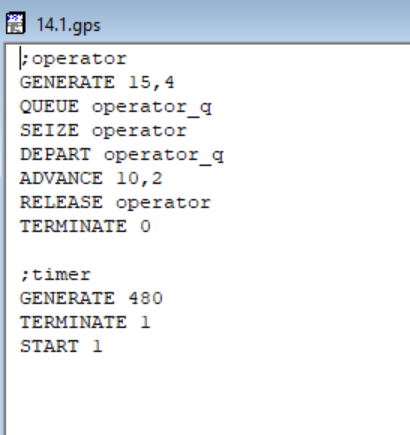
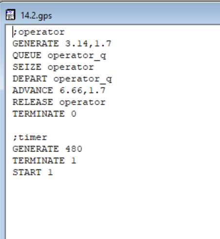
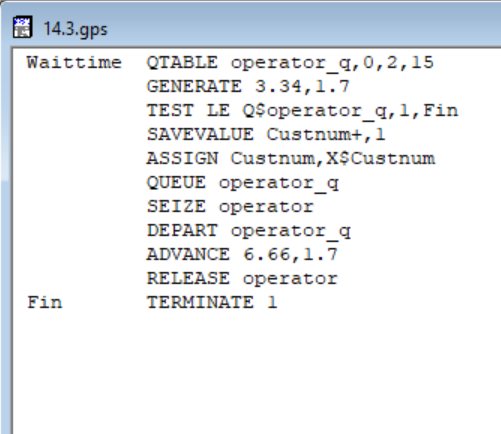
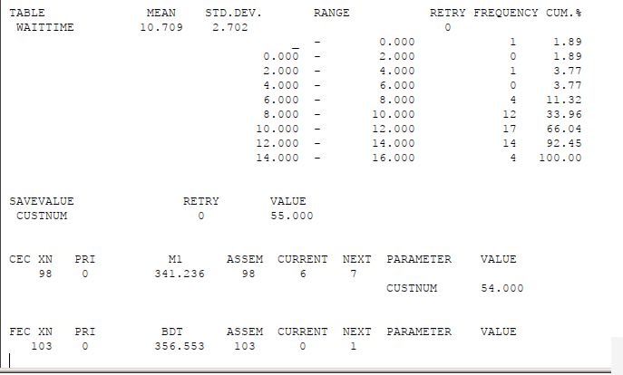
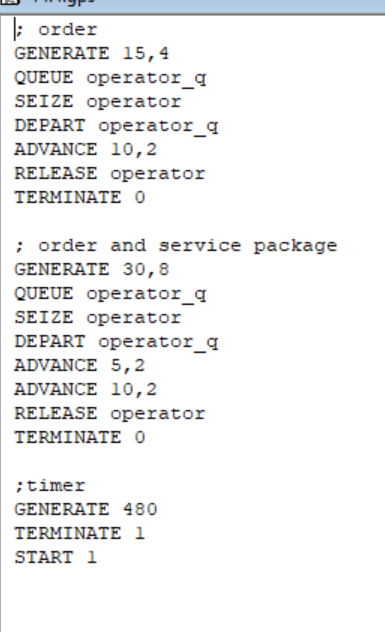
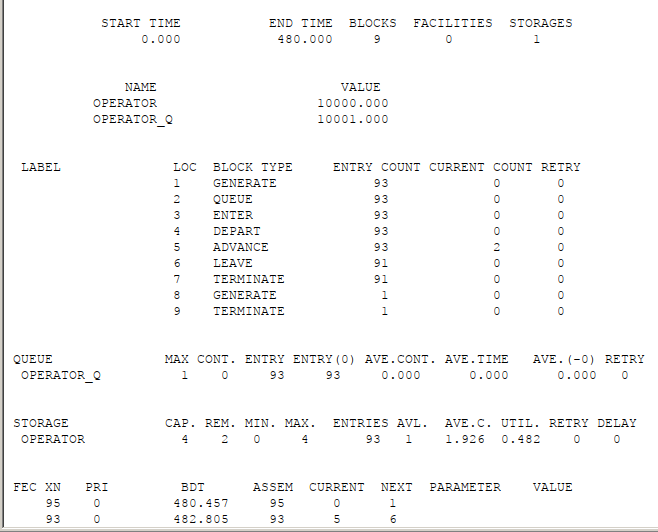
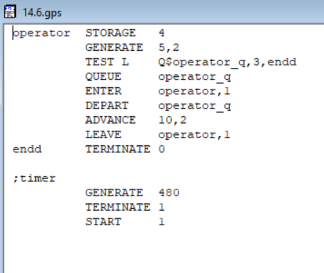
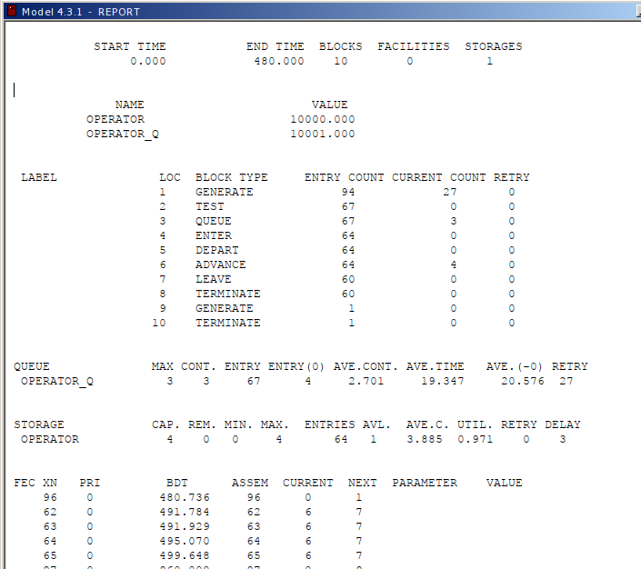

---
## Front matter
lang: ru-RU
title: Лабораторная работа 14
subtitle: Модели обработки заказов
author:
  - Герра Максимиано.
institute:
  - Российский университет дружбы народов, Москва, Россия

# Настройка polyglossia для XeLaTeX
polyglossia-lang:
  name: russian
  options:
    - spelling=modern
polyglossia-otherlangs:
  name: english

# Настройка вывода PDF
slide_level: 2
aspectratio: 169
section-titles: true
theme: metropolis
header-includes:
  - \usepackage{polyglossia}
  - \setmainlanguage[spelling=modern]{russian}
  - \setotherlanguage{english}
  - \metroset{progressbar=frametitle,sectionpage=progressbar,numbering=fraction}
  - \makeatletter
  - \beamer@ignorenonframefalse
  - \makeatother
---

# Информация

## Цель работы

Реализовать модели обработки заказов и провести анализ результатов.

## Задание

Реализовать с помощью gpss:

- модель оформления заказов клиентов одним оператором;
- построение гистограммы распределения заявок в очереди;
- модель обслуживания двух типов заказов от клиентов в интернет-магазине;
- модель оформления заказов несколькими операторами.

# Выполнение лабораторной работы

## Модель оформления заказов клиентов одним оператором

{#fig:001 width=40%}

## Модель оформления заказов клиентов одним оператором

{#fig:002 width=50%}

## Упражнение

{#fig:003 width=40%}

## Упражнение

{#fig:004 width=50%}

## Построение гистограммы распределения заявок в очереди

{#fig:005 width=50%}

## Построение гистограммы распределения заявок в очереди

{#fig:006 width=50%}

## Построение гистограммы распределения заявок в очереди

{#fig:007 width=70%}

## Построение гистограммы распределения заявок в очереди

{#fig:008 width=70%}

## Модель обслуживания двух типов заказов от клиентов в интернет-магазине

{#fig:009 width=40%}

## Модель обслуживания двух типов заказов от клиентов в интернет-магазине

{#fig:010 width=50%}

## Упражнение

{#fig:012 width=50%}

## Модель оформления заказов несколькими операторами

{#fig:013 width=40%}

## Модель оформления заказов несколькими операторами

{#fig:014 width=50%}

## Упражнение

{#fig:015 width=40%}

## Упражнение

{#fig:016 width=50%}

## Выводы

В результате была реализована с помощью gpss:

- модель оформления заказов клиентов одним оператором;
- построение гистограммы распределения заявок в очереди;
- модель обслуживания двух типов заказов от клиентов в интернет-магазине;
- модель оформления заказов несколькими операторами.
